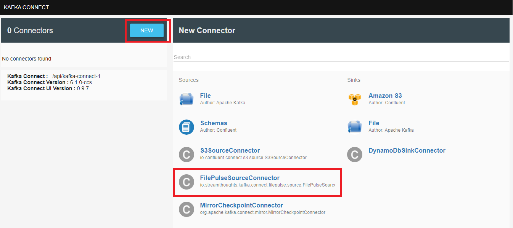
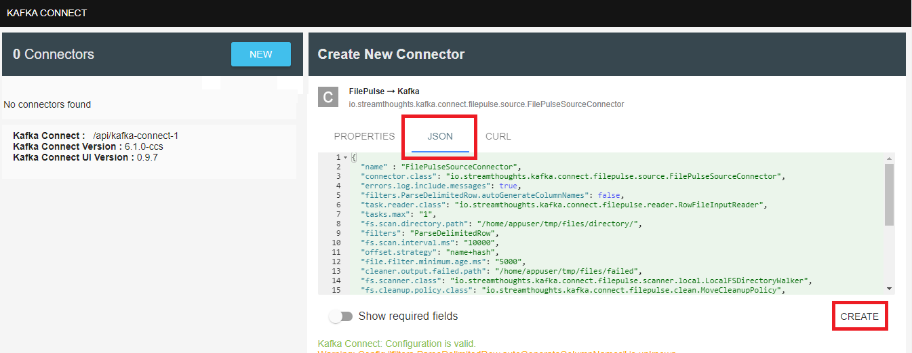
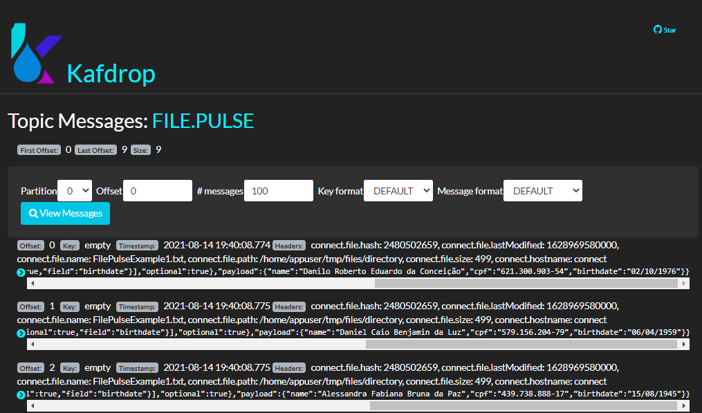
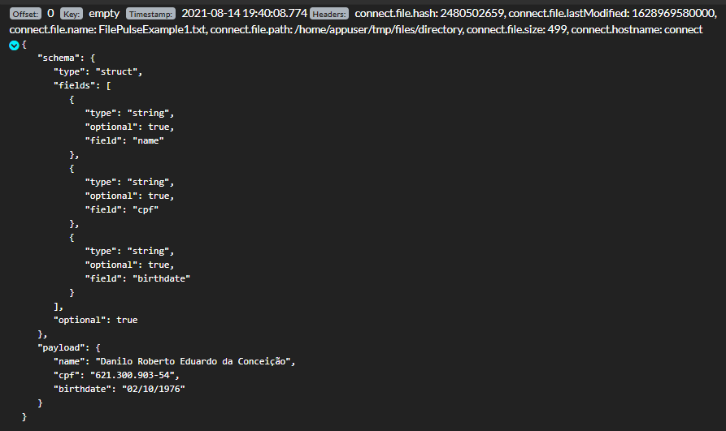

<h1 align="center">Kafka Connect</h1>

Descrição
=================

Exemplo de disponibilização da infra estrutura e criação de um componente utilizando Kafka Connect

  
  
  
  

Índice
=================
<!--ts-->
- [Descrição](#descrição)
- [Índice](#índice)
- [Como Usar](#como-usar)
- [Testes](#testes)
- [Status](#status)
<!--te-->

Como Usar
=================

#Pré Requesitos
* Docker instalado

#Subindo Aplicação
* Clonar repositório
* Navegar até a pasta do arquivo docker-compose.yml
* Rodar comando <b>docker-compose up -d</b>
* Validar se foi tudo criado e está UP com o comando <b>docker-compose ps</b>
* Acessar a url http://localhost:19000/ para abrir o Kafka Drop e listar os tópicos criados no Kafka
* Acessar a url http://localhost:8001/ para abrir o Kafka Connect UI e listar ou configurar um connector
* Ambiente pronto para os testes

Testes
=================
* Criar um novo connector para processar um arquivo, tranformar em Json e produzir mensagem no Kafka utilizando a aplicação http://localhost:8001/
	

		Clicar no botão "new" e escolher o connector 
    	 
    	Copiar o conteúdo do arquivo <b>file-pulse-source-connector.txt</b> e criar o connector 
    	 
    	Aguardar até ficar running 
    	
    

* Copiar o arquivo FilePulseExample.txt para dentro do container do Connect com o comando
    

        docker cp FilePulseExample.txt connect://home/appuser/tmp/files/directory/FilePulseExample1.txt
    

* Resultado esperado
    

		Acessar a aplicação http://localhost:19000/, navegar até o tópico onde as mensagens foram produzidas 
    	 
    	Verificar se o connect produziu uma mensagem para cada linha do arquivo 
    	 
    

Status
=================
<h4 align="center"> 
	🚧  kafka - Em construção...  🚧
</h4>
